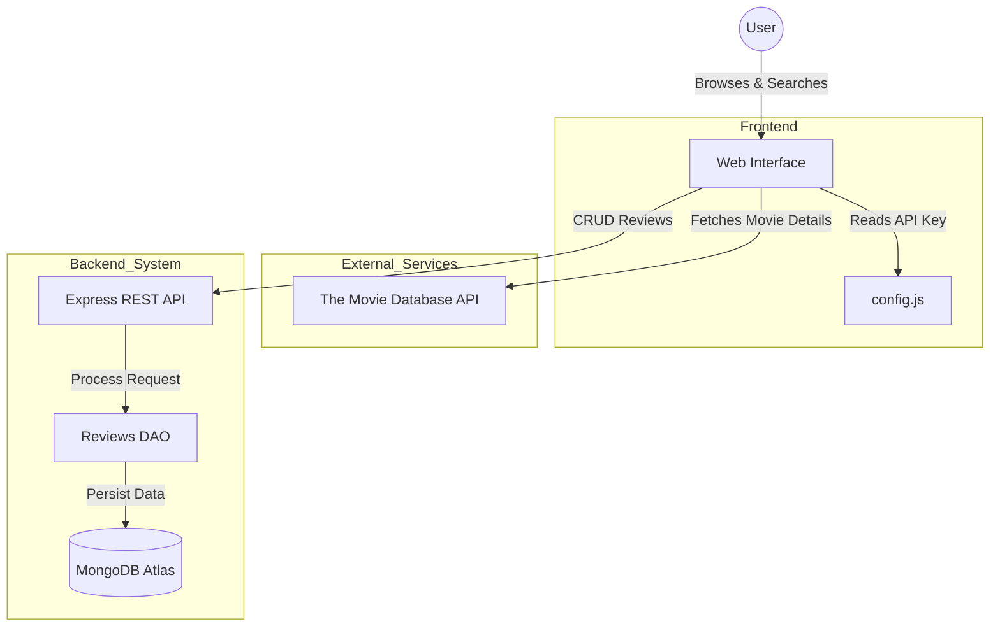

# Movie Reviews App 🎬

A full-stack movie review application that allows users to browse popular movies, search for specific titles, and manage reviews. The application features a modern responsive design with dark/light mode toggle and seamless movie data integration from The Movie Database (TMDb) API.

## 📖 Project Overview

This project demonstrates a full-stack web application architecture. It separates the concern of movie data retrieval (handled by the client-side directly from TMDb) and user-generated content (reviews, handled by the custom backend and MongoDB).

**Key Features:**
- **Movie Browsing:** Display popular movies with posters and titles.
- **Search:** Real-time search using TMDb API.
- **Reviews Management:** View, add, edit, and delete reviews for any movie.
- **Theming:** Dark/Light mode toggle with persistence.
- **Responsive UI:** Works on mobile and desktop.

## 🏗️ System Design

The application follows a client-server architecture where the frontend interacts with two distinct APIs: TMDb for read-only movie data and a custom Node.js/Express backend for review management.



## 📁 Directory Structure

```text
Movie app/
├── Back-end/                  # Node.js/Express Server
│   ├── api/                   # API Routes & Controllers
│   │   ├── reviews.controller.js
│   │   └── reviews.route.js
│   ├── dao/                   # Data Access Objects
│   │   └── reviewsDAO.js
│   ├── index.js               # Entry point
│   ├── server.js              # Server configuration
│   ├── package.json
│   └── .env                   # Environment variables (Create this)
├── Front-end/                 # Static Frontend Assets
│   ├── index.html             # Home page
│   ├── movie-reviews.html     # Reviews page
│   ├── movie-reviews.js       # Reviews logic
│   ├── script.js              # Home page logic
│   ├── style.css              # Home page styles
│   ├── movie-reviews.css      # Reviews page styles
│   └── config.js              # API Keys (Create this)
└── README.md
```

## 🛠️ Technologies & Tools

### Frontend
- **HTML5 & CSS3:** Semantic structure and custom styling.
- **JavaScript (ES6+):** DOM manipulation, Fetch API, Async/Await.
- **External API:** [The Movie Database (TMDb)](https://www.themoviedb.org/).

### Backend
- **Node.js:** Runtime environment.
- **Express.js:** Web framework for routing and middleware.
- **MongoDB & MongoDB Node Driver:** Database for storing reviews.
- **Cors:** Middleware for Cross-Origin Resource Sharing.
- **Dotenv:** Environment variable management.

## 🚀 Getting Started

Follow these instructions to set up the project locally.

### Prerequisites
- [Node.js](https://nodejs.org/) (v14+)
- [MongoDB Atlas](https://www.mongodb.com/atlas) account (or local MongoDB)
- [TMDb API Key](https://www.themoviedb.org/documentation/api)

### 1. Clone the Repository

```bash
git clone https://github.com/Abdelrahman-Yasser-Zakaria/Movie-Reviews-App.git
cd Movie-Reviews-App
```

### 2. Backend Setup

1.  Navigate to the backend directory:
    ```bash
    cd Back-end
    ```

2.  Install dependencies:
    ```bash
    npm install
    ```

3.  Create a `.env` file in the `Back-end` directory and add your MongoDB credentials:
    ```env
    MONGO_USERNAME=your_mongo_username
    MONGO_PASSWORD=your_mongo_password
    ```
    *Note: Ensure your MongoDB connection string in `index.js` matches your cluster setup if it differs from the default.*

4.  Start the server:
    ```bash
    node index.js
    ```
    You should see: `listening on port 8000`

### 3. Frontend Setup

1.  Open a new terminal and navigate to the frontend directory:
    ```bash
    cd Front-end
    ```

2.  Create a `config.js` file in the `Front-end` directory:
    ```javascript
    // Front-end/config.js
    const MOVIEDB_API_KEY = "YOUR_TMDB_API_KEY_HERE";
    ```
    *Replace `YOUR_TMDB_API_KEY_HERE` with your actual key from TMDb.*

3.  Serve the frontend. You can use a simple HTTP server or open `index.html` directly (though a server is recommended to avoid CORS issues with local files).

    **Using Python:**
    ```bash
    python3 -m http.server 3000
    ```

    **Using Node `http-server`:**
    ```bash
    npx http-server -p 3000
    ```

4.  Open your browser and visit: `http://localhost:3000`

## 🔌 API Endpoints

The backend exposes the following RESTful endpoints under `/api/v1/reviews`:

| Method | Endpoint | Description |
|--------|----------|-------------|
| `GET` | `/movie/:id` | Get all reviews for a specific movie ID |
| `POST` | `/newReview` | Add a new review |
| `GET` | `/:reviewId` | Get a specific review |
| `PUT` | `/:reviewId` | Update a review |
| `DELETE` | `/:reviewId` | Delete a review |
